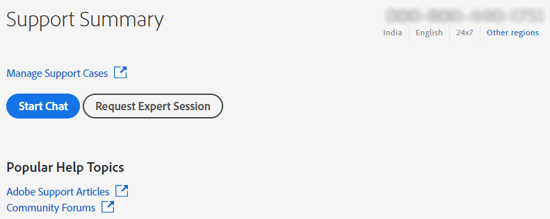

# Enterprise and teams | Contact Adobe Customer Care

To contact Adobe Customer Care, navigate to the **Support** tab in the [Admin Console](https://adminconsole.adobe.com/).

The **Support tab** in the [Admin Console](https://adminconsole.adobe.com/) lets you access various support options through a simple and easy-to-use interface. The options available in the Support tab depend on your subscription plan. For more information, click **Learn more** corresponding to your subscription plan.

If you are unsure about your subscription plan, navigate to the **Support tab** on the [Admin Console](https://adminconsole.adobe.com/), and compare your view with the images below. Then, click the corresponding **Learn more** link.

## For teams account

<!--
[Learn more](https://helpx.adobe.com/enterprise/using/support-for-teams.html)
-->

## For enterprise account

<!--
[Learn more](https://helpx.adobe.com/enterprise/using/support-for-enterprise.html)
-->

## For Experience Cloud

<!--
[Learn more](https://www.adobe.com/go/ac_ec_not_supported_en)
-->
