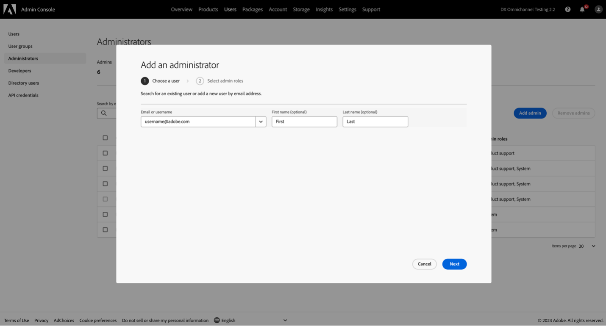
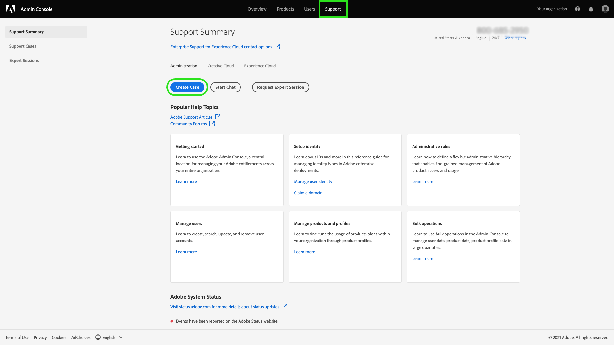

# Adobe Customer Support Experience

## Admin Console Support Tickets

Support Tickets are now able to be submitted via the [Admin Console](https://adminconsole.adobe.com/). For instructions on how to submit a support ticket, review the section for [submitting a support ticket](#submit-ticket).

We are working to improve how you interact with Adobe Customer Support. Our vision is to streamline the support experience by moving to a single entry point, using the Adobe Admin Console. Once live, your organization will be able to easily access Adobe Customer Support; have greater visibility into your service history via a common system across products; and request help via phone, web, and chat through a single portal.

## How to submit an Admin Console support ticket {#submit-ticket}

In order to submit a support ticket in [Admin Console](https://adminconsole.adobe.com/), you need to have the Support admin role assigned by a System Administrator. Only a System Administrator in your organization can assign this role. Product, Product Profile, and other administrative roles cannot assign the Support admin role and are unable to view the **[!UICONTROL Create Case]** option used to submit a support ticket. For more information, visit the [enterprise and teams customer care](customer-care.md) documentation.

### Assign the Support admin role

The support admin role is a non-administrative role that has access to support-related information. Support admins can view, create, and manage issue reports.

To add or invite an admin:

1. In the Admin Console, choose **[!UICONTROL Users]** > **[!UICONTROL Administrators]**.
1. Click **[!UICONTROL Add Admin]**.
1. Enter a name or email address.

   You can search for existing users or add a new user by specifying a valid email address and filling the information on the screen.

   

1. Click **[!UICONTROL Next]**. A list of admin roles appears.

To assign a Support Admin role to a user (enable a user to be able to contact support):

1. Select the **[!UICONTROL Support administrator]** option.

   

1. Choose one of the following two options:

   * Option 1: **[!UICONTROL Basic support administrator]**. Select this option if you would like to give the user support access for all solutions (except Marketo).
   * Option 2: **[!UICONTROL Product support administrator]**: Select this option for Marketo support. Select which Marketo instances to give the user support access.

   

1. Once you have made the selections, click **[!UICONTROL Save]**.

The user receives an email invitation regarding the new administrative privileges from `message@adobe.com`.

Users must click **Get started** in the email to join the organization. If new admins do not use the **Get started** link in the email invitation, they would not be able to sign into the Admin Console.

As part of the sign-in process, users may be asked to set up an Adobe profile if they do not have one already. If users have multiple profiles associated with their email address, users must choose **Join Team** (if prompted) and then select the profile associated with the new organization.

### Create a support ticket with Admin Console

To create a ticket using [Admin Console](https://adminconsole.adobe.com/), select the **[!UICONTROL Support]** tab located in the top navigation. The [!UICONTROL Support Summary] page appears. Next, select the **[!UICONTROL Create Case]** option.

>[!TIP]
>
> If you are unable to see the **[!UICONTROL Create Case]** option or the **[!UICONTROL Support]** tab, you need to contact a System Administrator to assign the Support admin role.

A dialog appears allowing you to select an issue type. Select the issue type that best describes your problem or question, then select **[!UICONTROL Create Case]** in the bottom-right.

The **[!UICONTROL Create Case]** dialog appears. You are asked to provide some information such as the product, priority, description, and attach any screenshots to help describe the issue. Select **[!UICONTROL Next]** to continue.

>[!NOTE]
>
> If the issue results in outages or extremely serious interruptions to a production system, a phone number is provided for immediate assistance.

The next page allows you to fill in contact information and provide the best time for Adobe Customer Support to contact you. Once complete, select **[!UICONTROL Submit]** in the bottom-right and your ticket is sent to Adobe Customer Support.

<!--

## What About the Legacy Systems?

New Tickets/Cases will no longer be able to be submitted in legacy systems as of May 11th.  The [Admin Console](https://adminconsole.adobe.com/) will be used to submit new tickets/cases.

### Existing Tickets/Cases

* Between May 11th and May 20th the legacy systems will remain available to work existing tickets/cases to completion.
* Beginning May 20th the support team will migrate remaining open cases from the legacy systems to the new support experience.  You will receive an email notification regarding how to contact support to continue to work these cases.
-->
