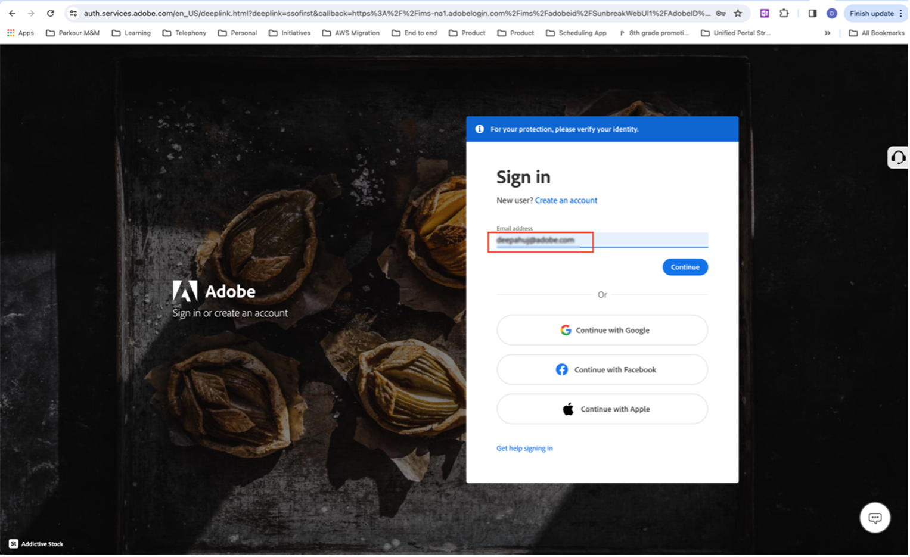
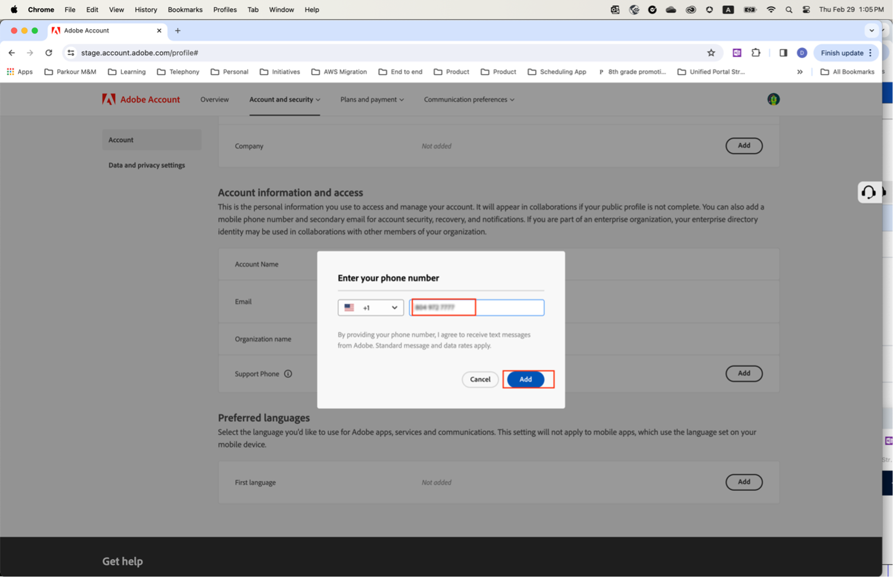

# Support Phone Number update

Today, when a user gets assigned an 'Admin' role such as a 'Product Support Admin', they get an email informing them that they have administrator rights to manage the instance they have been granted admin rights for. 
 
The same email is now modified to include the text below in red. 

Clicking on the **Account Profile** link opens a new window that prompts them to sign in using `account.adobe.com`.

They go through the login process and land on the screen below on account.adobe.com.
Where they click on the below tabs Account and security->Account to see the Support phone number field.

Add a phone number here that you would like us to use for recognizing you for your support needs. 

